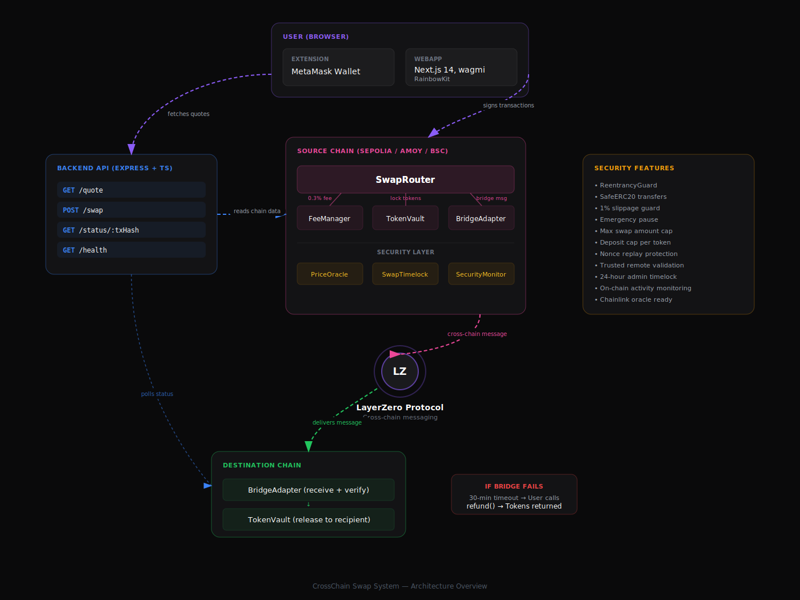

# CrossChain Swap System

A decentralized cross-chain token swap protocol that enables users to seamlessly swap ERC20 tokens across multiple blockchain networks. Built with a modular smart contract architecture, a secured RESTful backend API, and a modern Uniswap-inspired frontend interface.

## Overview

CrossChain Swap System allows users to initiate token swaps from one blockchain and receive tokens on a different blockchain. The protocol leverages LayerZero for secure cross-chain message passing, ensuring trustless and verifiable transfers between supported networks.

### Supported Networks

| Network | Chain ID | Type |
|---------|----------|------|
| Ethereum Sepolia | 11155111 | Testnet |
| Polygon Amoy | 80002 | Testnet |
| BSC Testnet | 97 | Testnet |

## Architecture



### Swap Flow

1. User connects wallet and selects source token, destination chain, and recipient
2. Frontend fetches a quote from the backend API (debounced 500ms)
3. User reviews quote details: output amount, fees, gas estimate, ETA
4. User approves the ERC20 token spend and signs the swap transaction
5. **SwapRouter** validates inputs, checks slippage and swap caps, deducts protocol fee, and locks tokens in **TokenVault**
6. **BridgeAdapter** sends a cross-chain message via LayerZero to the destination chain
7. Destination chain **BridgeAdapter** receives and validates the message (trusted remote + nonce check)
8. **TokenVault** releases tokens to the recipient on the destination chain
9. Frontend polls transaction status: Submitted → Source Confirmed → Bridging → Complete
10. If bridge fails, user can call `refund()` after 30-minute timeout

## Smart Contracts

### Core Contracts

| Contract | Description |
|----------|-------------|
| **SwapRouter** | Main entry point for cross-chain swaps. Handles token transfers, fee deduction, slippage protection (1% default, 5% max), max swap amount per transaction, and emergency pause capability |
| **BridgeAdapter** | Manages cross-chain messaging via LayerZero. Sends and receives messages with nonce tracking to prevent replay attacks. Validates trusted remotes to reject spoofed messages |
| **TokenVault** | Locks ERC20 tokens during cross-chain transfers with a 30-minute refund timeout. Tracks per-token deposit caps and total locked amounts to prevent concentration risk |
| **FeeManager** | Collects 0.3% protocol fees per swap with access-controlled fee collection (only SwapRouter). Owner can withdraw accumulated fees to treasury |

### Security Contracts

| Contract | Description |
|----------|-------------|
| **PriceOracle** | Chainlink-ready price oracle with staleness checks, negative price rejection, and swap price deviation detection. Uses fallback prices on testnet, zero-change switch to Chainlink on mainnet |
| **SwapTimelock** | Enforces 24-hour delay on all admin configuration changes. Operations must be scheduled, waited on, then executed within a 48-hour grace period. Prevents instant malicious changes from compromised keys |
| **SecurityMonitor** | On-chain activity surveillance system. Detects large swaps, rapid trading patterns, and flags suspicious addresses. Supports blacklisting to block known attackers |

### Mock Contracts (Testing Only)

| Contract | Description |
|----------|-------------|
| **MockERC20** | Test ERC20 token with public mint function |
| **MockLzEndpoint** | Simulates LayerZero endpoint for local testing |

## Security

### Smart Contract Security (16 Protections)

- **ReentrancyGuard** on all token-moving functions
- **SafeERC20** for safe token transfers handling non-standard tokens
- **Slippage protection** with configurable max tolerance (default 1%, cap 5%)
- **Role-based access control** — each function restricted to authorized callers only
- **Nonce tracking** to prevent cross-chain replay attacks
- **Trusted remote verification** for cross-chain message authentication
- **30-minute timeout** with user-initiated refund for failed transfers
- **Emergency pause** (circuit breaker) on SwapRouter and TokenVault
- **Max swap amount** per transaction to prevent whale manipulation
- **Deposit cap per token** to prevent concentration risk (Venus attack mitigation)
- **Donation attack immunity** — mapping-based accounting, not balanceOf()
- **Chainlink-ready price oracle** with staleness and deviation checks
- **24-hour timelock** on all admin configuration changes
- **On-chain activity monitoring** with automatic flagging and blacklist
- **Immutable state variables** for gas optimization and safety
- **Custom errors** for gas-efficient reverts (~5x cheaper than require strings)

### Backend Security (8 Protections)

- **Input validation** with express-validator (address regex, amount bounds, chain whitelist)
- **Rate limiting** at 100 requests/minute/IP
- **Helmet** security headers (CSP, X-Frame-Options, HSTS, XSS Protection)
- **CORS** restricted to frontend origin only
- **Body size limit** of 10KB to prevent payload-based DoS
- **Generic error messages** — no stack traces or internal details leaked
- **Cache eviction** with TTL (30 min) and max size (1000) to prevent memory leaks
- **Backend never signs transactions** — user's private key never leaves MetaMask

### Audit Tools

| Tool | Result |
|------|--------|
| Slither (static analysis) | All production findings resolved |
| npm audit | 0 dependency vulnerabilities |
| Hardhat test suite | 56 tests passing |

## Tech Stack

| Layer | Technology |
|-------|-----------|
| Smart Contracts | Solidity ^0.8.24, Hardhat, OpenZeppelin v5, TypeScript |
| Backend | Node.js, Express, ethers.js v6, Helmet, TypeScript |
| Frontend | Next.js 14, Tailwind CSS v4, wagmi v2, RainbowKit |
| Cross-Chain | LayerZero Protocol |
| Fonts | Space Grotesk (headings), Inter (body) |
| Deployment | Vercel (frontend), Railway (backend) |

## Project Structure

```
├── contracts/                    # Solidity smart contracts
│   ├── src/
│   │   ├── SwapRouter.sol        # Main swap entry point
│   │   ├── BridgeAdapter.sol     # LayerZero cross-chain messaging
│   │   ├── TokenVault.sol        # Token custody + refunds
│   │   ├── FeeManager.sol        # Fee collection + treasury
│   │   ├── PriceOracle.sol       # Chainlink-ready price feeds
│   │   ├── SwapTimelock.sol      # 24-hour admin delay
│   │   ├── SecurityMonitor.sol   # Activity surveillance
│   │   └── mocks/                # Test mock contracts
│   ├── test/                     # 56 automated tests
│   └── hardhat.config.ts
├── backend/                      # Express REST API
│   └── src/
│       ├── config/chains.ts      # Chain configurations
│       ├── routes/
│       │   ├── quote.ts          # GET /quote
│       │   ├── swap.ts           # POST /swap
│       │   ├── status.ts         # GET /status/:txHash
│       │   └── health.ts         # GET /health
│       ├── services/
│       │   ├── priceService.ts   # Quote calculation engine
│       │   ├── txBuilder.ts      # Unsigned transaction builder
│       │   └── statusService.ts  # Status tracking + cache
│       ├── middleware/
│       │   └── errorHandler.ts   # Global error handler
│       └── utils/
│           └── providers.ts      # ethers.js RPC providers
├── frontend/                     # Next.js 14 application
│   ├── app/
│   │   ├── layout.tsx            # Root layout + fonts
│   │   ├── page.tsx              # Home page (swap interface)
│   │   ├── providers.tsx         # Client-side provider wrapper
│   │   └── globals.css           # Design system + themes
│   ├── components/
│   │   ├── layout/               # Header, Footer, Stats, Features
│   │   ├── swap/                 # SwapCard, SwapButton, TransactionStatus
│   │   ├── wallet/               # ConnectWalletButton, NetworkBanner
│   │   ├── token/                # TokenSelector
│   │   └── ui/                   # Button, Card, Modal, Spinner, etc.
│   ├── hooks/                    # useSwapQuote, useTransactionStatus
│   ├── providers/                # ThemeProvider, Web3Provider
│   ├── config/                   # wagmi config, token lists
│   └── lib/                      # Types, constants, utilities
├── package.json                  # Root workspace config
└── .env.example                  # Environment variable template
```

## API Endpoints

| Method | Endpoint | Description |
|--------|----------|-------------|
| GET | `/quote` | Returns swap pricing: output amount, fees, gas, ETA |
| POST | `/swap` | Builds unsigned transaction for frontend signing |
| GET | `/status/:txHash` | Polls cross-chain swap status with retry logic |
| GET | `/health` | Server health + RPC connectivity check |

## Getting Started

### Prerequisites

- Node.js 18 LTS
- MetaMask wallet
- Alchemy API keys (Sepolia, Amoy, BSC Testnet)
- Testnet tokens (ETH, MATIC, BNB)

### Installation

```bash
# Clone the repository
git clone git@github.com:minato32/Swap-token.git
cd Swap-token

# Install dependencies
npm install

# Copy environment variables
cp .env.example .env
# Fill in your API keys and private key

# Compile contracts
cd contracts && npx hardhat compile

# Run tests (56 tests)
npx hardhat test

# Start backend (Terminal 1)
cd backend && npm run dev

# Start frontend (Terminal 2)
cd frontend && npm run dev
```

### Environment Variables

```
ALCHEMY_SEPOLIA_URL=           # Alchemy RPC URL for Sepolia
ALCHEMY_AMOY_URL=              # Alchemy RPC URL for Polygon Amoy
ALCHEMY_BSC_URL=               # Alchemy RPC URL for BSC Testnet
PRIVATE_KEY=                   # Deployer wallet private key

NEXT_PUBLIC_ALCHEMY_SEPOLIA_URL=   # Frontend RPC (same as above)
NEXT_PUBLIC_ALCHEMY_AMOY_URL=      # Frontend RPC
NEXT_PUBLIC_ALCHEMY_BSC_URL=       # Frontend RPC
NEXT_PUBLIC_API_URL=               # Backend API URL (default: http://localhost:3001)
```

## Testing

56 automated tests across 7 contract test suites:

- **SwapRouter** — swap execution, slippage rejection, access control
- **BridgeAdapter** — cross-chain send/receive, nonce tracking, trusted remote
- **TokenVault** — lock, release, refund, timeout, deposit caps
- **FeeManager** — fee calculation, collection access control, treasury withdrawal
- **PriceOracle** — fallback prices, deviation detection, staleness
- **SwapTimelock** — schedule, execute after delay, expiry, cancellation
- **SecurityMonitor** — large swap detection, rapid trading, blacklist

```bash
cd contracts
npx hardhat test
```

## Security Design Rationale

This protocol's security architecture was specifically designed to mitigate real-world DeFi attack vectors, including the **Venus Protocol March 2026 exploit** ($3.7M stolen via donation attack + oracle manipulation). Key mitigations include:

- **Donation attack immunity** — TokenVault uses explicit deposit tracking via mappings, not `balanceOf()`, making it immune to exchange rate inflation via direct token transfers
- **Concentration limits** — Per-token deposit caps prevent any single entity from accumulating excessive protocol exposure
- **Oracle hardening** — Chainlink integration with staleness thresholds and price deviation detection prevents price manipulation loops
- **Admin delay** — 24-hour timelock gives the community reaction time if owner keys are compromised
- **Activity surveillance** — On-chain monitoring detects and flags anomalous trading patterns before damage escalates

## License

MIT
